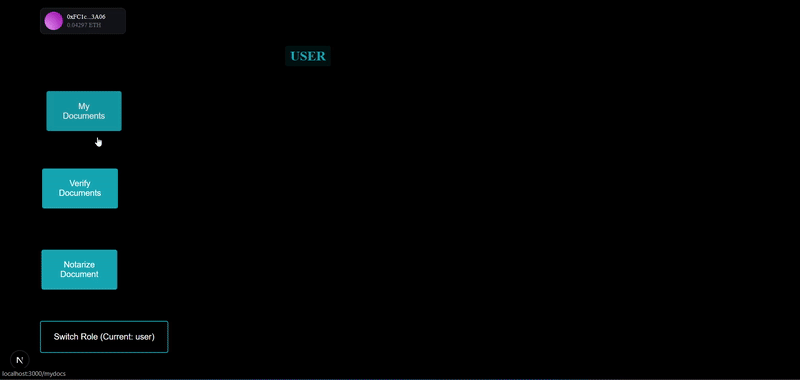

# Blockchain-Based Notary System

A decentralized notary platform for document verification and notarization using blockchain technology. Built with Next.js (TypeScript) for the frontend, Solidity for the smart contracts, and Thirdweb for smart contract deployment and management. The project is deployed on Vercel and tested on the Sepolia testnet.

### 📝 Features

* **Decentralized Document Notarization** – Verify and notarize documents securely on the blockchain.
* **Smart Contract Powered** – Uses Solidity for immutable, tamper-proof contracts.
* **Seamless Integration** – Powered by Thirdweb for simplified smart contract management.
* **Wallet Connection** – Connect your wallet for decentralized authentication.
* **Admin Controls** – Includes admin functionalities like signing, revoking, and certifying documents.

### 🚀 Live Demo

Check out the live project here: [Blockchain-Based Notary System](https://blockchain-based-notary-lb54jgxn5-call-me-sumans-projects.vercel.app/)

### 🛠️ Tech Stack

* **Frontend:** Next.js (TypeScript)
* **Smart Contracts:** Solidity
* **Deployment:** Thirdweb, Vercel
* **Network:** Sepolia Testnet

### 📸 Screenshots

#### Main Page


#### Notarize Document Page


#### All Options View



### 📦 Installation

1. Clone the repository:

```bash
git clone https://github.com/call-me-suman/Blockchain-based-Notary-.git
```

2. Install dependencies:

```bash
npm install
```

3. Run the development server:

```bash
npm run dev
```

### 🚀 Deployment

Deployed on Vercel with smart contract on Sepolia testnet. You can fork this project and deploy your own version using Vercel.

### 📄 License

This project is licensed under the MIT License.

### 🤝 Contributing

Contributions are welcome! Feel free to open a PR or an issue.


